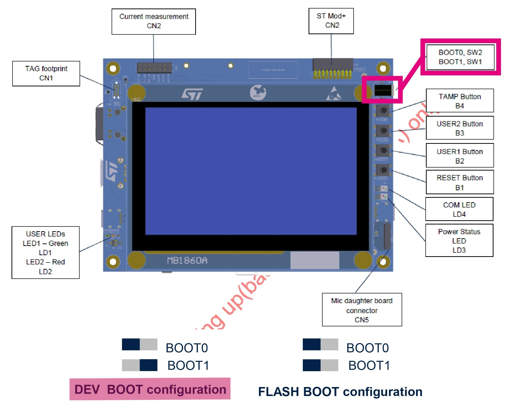
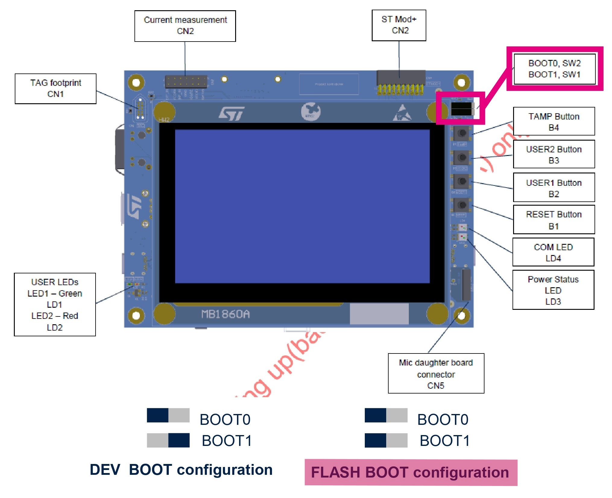
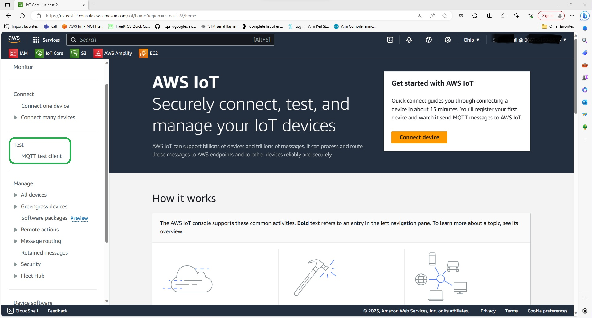
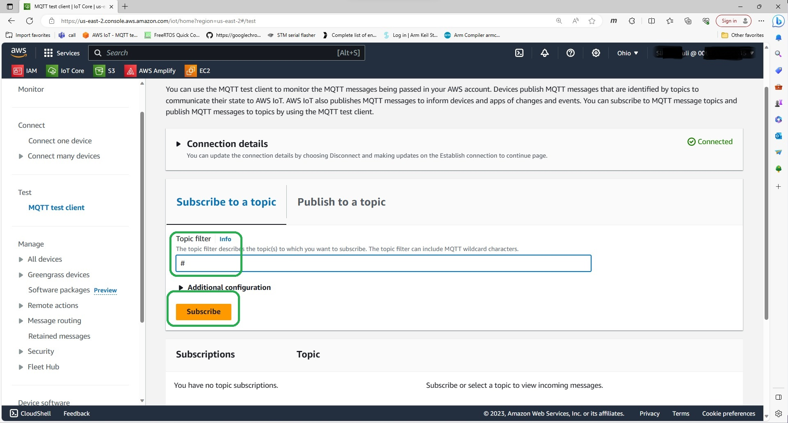
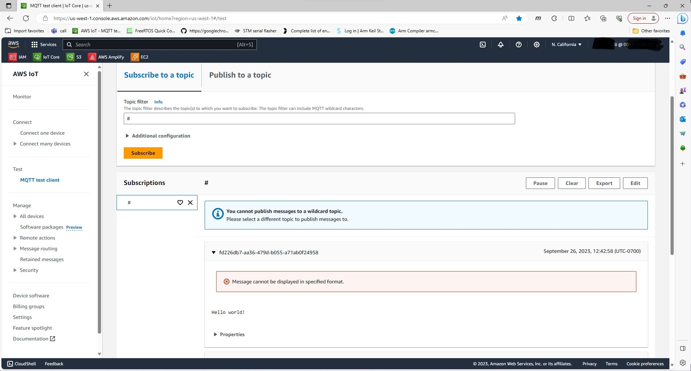
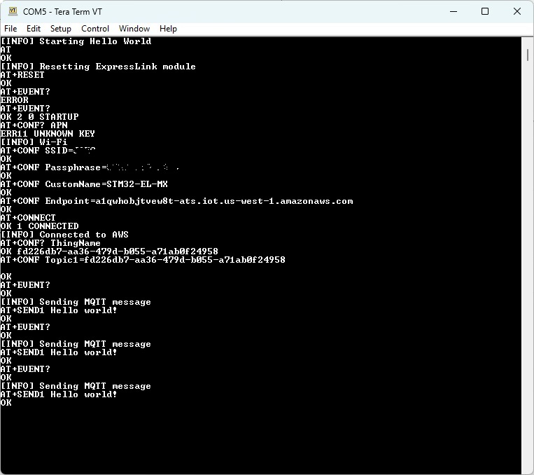

# I-CUBE-ExpressLink for STM32N6

## 1. Overview

*   **I-CUBE-ExpressLink** is a CMSIS pack for the <a href="https://aws.amazon.com/iot-expresslink/" target="_blank">ExpressLink</a> driver for <a href="https://www.st.com/en/microcontrollers-microprocessors/stm32-32-bit-arm-cortex-mcus.html" target="_blank">STM32</a> devices. It allows you to create applications that **connects to AWS IoT Core** using <a href="https://devices.amazonaws.com/search?page=1&sv=iotxplnk" target="_blank">ExpressLink modules</a> and to issue **Host Over-The-Air Updates**, in addition of **many other projects**.

*   **Connecting your STM32N6 board to AWS and publishing messages: Hello World project**\
    This project allows you to connect your board to AWS cloud service IoT Core through the Expresslink module, and send Hello World messages from the board to AWS that can be obsvered in AWS IoT console.

* STM32N6 devices are **Flashless** MCUs that provide several memory units for your FW to run. In this project we are using the [STM32N6570-DK Discovery kit](https://www.st.com/en/evaluation-tools/stm32n6570-dk.html).

* Additionnal notes :
   * The driver is compatible with <a href="https://aws.amazon.com/about-aws/whats-new/2022/11/aws-iot-expresslink-technical-specification-v1-1-released/" target="_blank">AWS IoT ExpressLink Technical Specification v1.1</a> or higher.
   * You will need to connect your board to a Wi-Fi that is at least 2.4 GHz.
   * The pack was tested with the following ExpresssLink Modules:
   <a href="https://devices.amazonaws.com/detail/a3G0h00000E2JnNEAV/ESP32-C3-AWS-IoT-ExpressLink-Module" target="_blank">ESP32-C3</a> (Wi-Fi)


## 2. STM32N6 specificities

STM32N6 devices are **Flashless** MCUs that provide several memory units for your FW to run.  
Because of this specificity, the procedure to create projects, flash and debug  is different than with other STM32 boards.

### 2.1 Memory usage
STM32N6 devices allow you to load and execute your code from different memory units. You can either :
* **Load and execute** the FW from **internal memory SRAM**.
* **Load** in one of the available type of **External Memory** Unit and **execute** the FW from **internal memory SRAM**.
* **Load and execute** the FW from one **External Memory** Unit (XiP Execute in Place).

>In this repository we used the most common and easiest to work with setup :
we will **flash our binaries in the External Flash NOR memory unit and execute from the SRAM.**


### 2.2 Projects structure
STM32N6 Projects available structures are the following :
* **FSBL only** : a First Stage Boot Loader that integrates your FW, assuming the FW is simple and lightweight.
* **FSBL + Application** : FSBL is used to set up the application running depending on its location and can integrate minor tasks. The application is your FW.
* **FSBL + Non Secure Application + Secure Application** : same as previous adding a dedicated project and memory location to protect the Secure Application project content.

>In this repository we used the most common and easiest to work with project structure for N6 boards, the **FSBL + Application**.  In our project :
>* The FSBL is used to configure the **System Clock**
>* The App integrates **I-Cube-Expresslink** and **HelloWorld** 

### 2.3 FW execution workflow

* After a Reset, the integrated BootROM of the board executes.
* If the FSBL was loaded in an external memory unit, BootROM copies it from there into the internal memory SRAM.
    >This project case :  copies the FSBL from the NOR External flash 0x70000000 into the SRAM 0x34180000
* Jump from the BootROM into the FSBL copy located in the SRAM and FSBL executes from the SRAM.
* If an application project was loaded in an external memory, then :
    * If running from external memory, FSBL sets up the execute in place running environment.  
     Otherwise copies the Application from the External memory into the SRAM.
        >This project case :  copies the Application from the NOR External flash 0x70100000 into the SRAM 0x034000000.

    * Jump from the FSBL into the Application.
    * The Application executes.


## 3. Getting started

### 3.1 Prerequisites

Follow the instruction of this [I-Cube-Expresslink GitHub page](https://github.com/stm32-hotspot/I-CUBE-ExpressLink) to :
* Dowload and install the tools and CMSIS packs
* Set up your AWS developpement account
* Set up and register ExpressLink module to your AWS account

### 3.2 Clone the repository
Open a GitBash window in the location you want to import the project into and run the following commands :

```bash
git clone https://github.com/Ldupe/FreeRTOS_STM32N6570-DK.git
git submodule update --init --recursive
```

### 3.3 Build the project

* Import the project folder *HelloWorld* in [STM32CubeIDE](https://www.st.com/stm32cubeide).
* You should obtain one project containing the two subprojects *Appli* and *FSBL*.  
Build both of them.

### 3.4 Flash and run the project

STM32N6 boards require binaries to be signed and flashed in a specific way. To do so :

* Connect your STM32N6 board to your PC using STLink and make sure that the Expresslink module is plugged into the board
* Set your STM32N6 board in DEV_BOOT mode, meaning the Boot Pin switch buttons are set as following :

   

* Hit the Reset button for the Boot Pin switches new position to be taken into account.
* Open a GitBash window in the *HelloWorld* folder.  
  Run the following command in GitBash to run the *flash.sh* script that will sign (adding header and padding) and flash both the FSBL and Appli binaries into your board :

    ```bash
    sh flash.sh
    ```

    ***Script Troubleshoot***
    * *Try powercycling the board, make sure the switches are in DEV_BOOT mode, hit Reset and run the script again.  
    **This error happens often** and there is currently no available fix.*
    * *Make sure that the binary generation is enabled in both the FSBL and Appli project configuration :  
    Properties > C/C++ Build > Settings > MCU/MPU Post build outputs > Check "Convert to binary file" box*
    * Make sure no other software is monopolizing the serial connection.

* Switch the board to FLASH_BOOT mode, meaning the Boot Pin switch buttons are set as following :  

   

* Hit the Reset button for the Boot Pin switches new position to be taken into account and start the FW execution.

**The project should start running.  
You should see the Green LED2 toggling at the bottom left of the [STM32N6570-DK](https://www.st.com/en/evaluation-tools/stm32n6570-dk.html) board.**


***Troubleshoot : if the Red LED1 is on***  
   * *It could mean you have not hit the reset button*
   * *It could mean you are still in DEV_BOOT mode : switch the BootPins to FLASH_Boot mode and hit the Reset button*  
   * *Try powercycling the board*    
   * *It could mean that the BootROM is failing to find the firmware code. Flash the board again by starting over the steps of this section*


### 3.5 Check messages on AWS IoT Core MQTT test client and Serial Terminal

* On <a href="http://console.aws.amazon.com/iot" target="_blank">AWS IoT Console</a> select the **MQTT test client**

<p align="center"></p>

* Under **Topic filter** use **#** to subscribe to all the topics
* Click **Subscribe**

<p align="center"></p>

* Observe the messages coming in

<p align="center"></p>

* You can check the debug messages on the serial terminal as well using the following settings : 115200, 8-bits, 1 Stop, No parity  

<p align="center"></p>


**Congratulations! You are connected to AWS IoT core and sending MQTT messages.**


## 4. Debugging the project

You can debug the project in a way that allows you to monitor the **execution of the FSBL, the jump from the FSBL to the Application, and then the execution of the application.**  
To do so :

* **Flash** the binaries using the *flash.sh* script while in DEV_BOOT mode (See above).
* Leave the board in **DEV_BOOT** mode to be able to enter Debug.
* **Start the debug** session of the *Appli* project using STM32CubeIDE.  
**The Debug session wil start in the FSBL and you will be able to debug the FSBL, the jump and the Application.**
* If you need to add **breakpoints**, right click where you want to put your breakpoint instead of a double click, then select *Add breakpoint* them select ***Hardware*** for *Type*.

The debug specific configuration should be already saved in the project so no other step is required.  
For you reference, here is the Debug Configuration being used to monitor the FSBL, the jump and the App :
* Select the Appli project > Debug As > Debug Configuration > Startup
    * Add item > Select the FSBL project > Uncheck Build > Check Download
    * Edit item > Select the Appli project > Uncheck Download


## 5. Implement your changes

Using [STM32CubeMX](http://www.st.com/stm32cubemx) :
* Make sure that you have downloaded and installed all the necessary CMSIS packs
* Open the *HelloWorld.ioc* file with [STM32CubeMX](http://www.st.com/stm32cubemx).
* Proceede to your changes and click *Generate Code* once finished.
* Open the project in [STM32CubeIDE](https://www.st.com/stm32cubeide).
* After any new STM32CubeMX code generation, the following file needs to be edited :

   ```
   /LoadAndRun/Middlewares/ST/STM32_ExtMem_Manager/boot/stm32_boot_lrun.c
   ```

   Go to line 35 and set the external memory offset to 0x400 :
   
   ```
   #define EXTMEM_HEADER_OFFSET 0x400
   ```
* Save and Build the FSBL project
* Build the Appli project

Using [STM32CubeIDE](https://www.st.com/stm32cubeide) :
* Proceede to your changes in the FSBL and Appli projects.
* Build the FSBL and Appli projects and flash and debug as indicated above.
